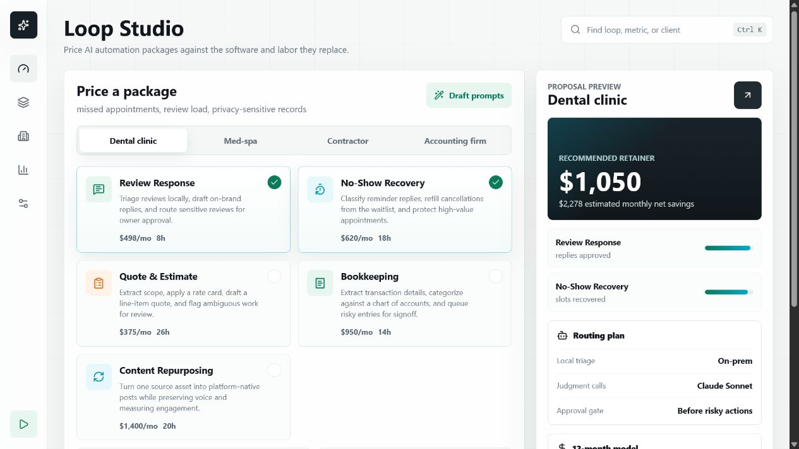
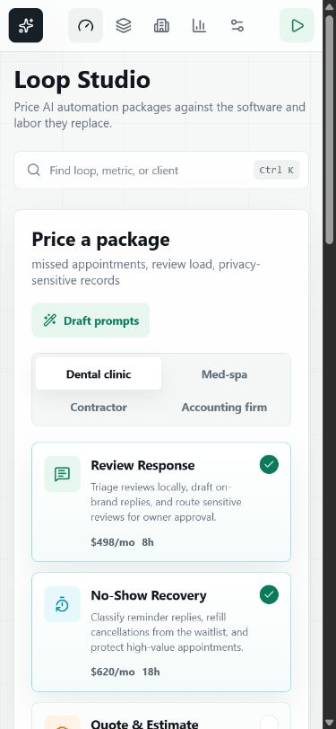

# AI Automation Loop Pricing Dashboard

A modern React dashboard for pricing AI automation loops for local businesses. The app helps an automation consultant turn vague "AI agent" ideas into concrete packages with value-replaced math, setup pricing, monthly retainer estimates, and a proposal-ready preview.

**Live demo:** [https://loop-studio-one.vercel.app](https://loop-studio-one.vercel.app)



## Problem It Solves

Small businesses rarely buy abstract "AI agents." They buy outcomes they already understand: fewer missed appointments, faster quotes, review replies, cleaner books, and more content from assets they already created.

The hard part for an automation consultant is pricing that work clearly. Many builders price from their own hours or API costs, which makes the offer feel arbitrary. This dashboard prices against the software subscriptions and labor hours the automation replaces, so the proposal is anchored to business value.

## What I Built

I built a responsive SaaS-style pricing workspace where a consultant can:

- Pick a local business type, such as a dental clinic, med-spa, contractor, or accounting firm.
- Select automation loops like Review Response, No-Show Recovery, Quote & Estimate, Bookkeeping, and Content Repurposing.
- Adjust labor value, retainer share, and whether the package needs an on-prem privacy box.
- Calculate value replaced, setup fee, monthly retainer, and estimated monthly savings.
- Preview a proposal summary with selected loops, confidence meters, routing plan, and 12-month pricing model.

## Screenshots

### Desktop


### Mobile



## Features

- Business-specific loop presets for common local-service clients.
- Interactive loop selection with live pricing updates.
- Value-replaced calculator based on software cost, labor hours, loaded hourly rate, and retainer share.
- Proposal preview with recommended retainer, setup fee, estimated savings, and routing plan.
- Responsive interface designed for both desktop sales calls and mobile review.
- Clean modern SaaS UI with compact dashboard controls and lucide icons.

## Tech Stack

- React
- Vite
- Lucide React
- Plain CSS design system
- Vercel deployment

## Run Locally

```bash
npm install
npm run dev
```

## Build

```bash
npm run build
```
